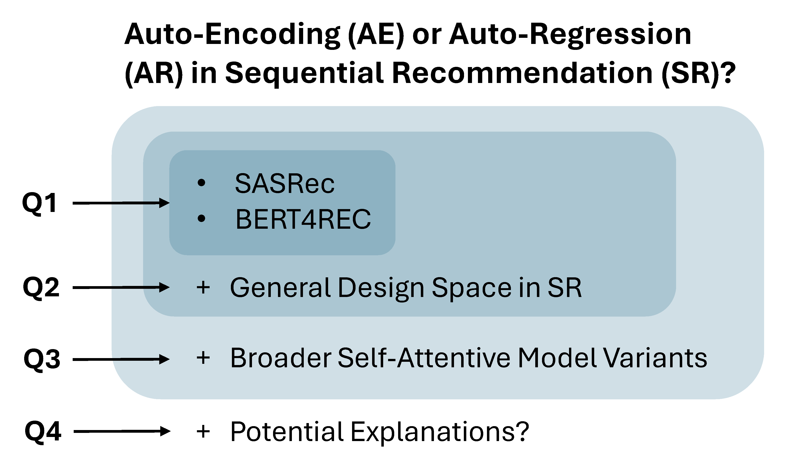

# Auto-Encoding or Auto-Regression? A Reality Check on Causality of Self-Attention-Based Sequential Recommenders.

[Under review]: Auto-Encoding or Auto-Regression? **A Reality Check on Causality of Self-Attention-Based Sequential Recommenders [[Paper](https://arxiv.org/pdf/2406.02048)][[Code](https://github.com/yueqirex/ModSAR)]**.

PyTorch-Lightning and Ray-Tune implemented AE-AR comparison for self-attentive sequential recommendation.


## Scope and hierarchy of study
 This work studies the comparison between Auto-Encoding (AE) and Auto-Regression (AR) for sequential recommendation in a hierarchical format:
1. Representative model comparison: SASRec-BERT4REC (comparing evaluation environment, fairness, etc.).
2. General, modularized design space of self-attentive sequential recommenders.
3. Broader self-attentive model variants (Huggingface ecosystem on recommendation datasets).

## Requirements
Key packages are Numpy, PyTorch-Lighting, PyTorch, huggingface-hub and ray-tune; Versions of all packages are detailed in ```requirements.txt```. Use below command to install all required packages (Using pip inside a new conda environment is recommended, another way to guarantee max compatibility is to first install key packages with versions in ```requirements.txt``` which usually works as we tested).
```bash
pip install -r requirements.txt
```

## Datasets
Due to relatively large disk space needed for datasets (a few megabytes). We store datasts in a annonymized google drive, please download [[here](https://drive.google.com/drive/folders/1IAt-S770J-cuvrbf-k_Zop4nHj6QmAMk?usp=sharing)]. After download, please unzip all files and put `data_bert4rec_standard_reproduce` and `data_standard` folders under `./BERT4REC` folder. Put `modularized` folder under `./ModSAR/data` folder. Note that `data_standard` and `modularized` has the same data processing but stored as different formats for convenient data loading. Both preprocessed data and the data preprocessing code are included in the .zip files.


## Run experiments of BERT4REC-AE vs. BERT4REC-AR (Section 4 in paper)
We will list (1) best hyper-parameters (2) running command for each of the following four experiments. For all the ```.sh``` files to execute the experiments, we have already pre-written the best hyper-parameters and configs into it so no need to change them in ```.sh``` again. All the ```.sh``` files support tuning functions, but as mentioned we have pre-set them in a way to only run the best hyper-parameters to derive paper results in table 3 in paper.

Navigate to ```./BERT4REC/env_bert4rec``` and run
```bash
bash search_standard_sample.sh
```
to derive results for BERT4REC-AE vs. BERT4REC-AR with: (1) SASRec-like cononical environment discussed in Table 2 in paper, (2) Popularity-sampling-based evaluation.

Navigate to ```./BERT4REC/env_bert4rec``` and run
```bash
bash search_standard_allrank.sh
```
to derive results for BERT4REC-AE vs. BERT4REC-AR with: (1) SASRec-like cononical environment discussed in Table 2 in paper, (2) All-ranking-based evaluation.

Navigate to ```./BERT4REC/env_bert4rec``` and run
```bash
bash search_bert4rec_standard_reproduce_sample.sh
```
to derive results for BERT4REC-AE vs. BERT4REC-AR with: (1) BERT4REC-like original environment discussed in Table 2 in paper, (2) Popularity-sampling-based evaluation.

Navigate to ```./BERT4REC/env_bert4rec``` and run
```bash
bash search_bert4rec_standard_reproduce_allrank.sh
```
to derive results for BERT4REC-AE vs. BERT4REC-AR with: (1) BERT4REC-like original environment discussed in Table 2 in paper, (2) All-ranking-based evaluation.


## Run experiments of AE/AR comparison in modularized common design space (Section 5 in paper)
Nacigate to ```./ModSAR/src``` and run
```bash
bash search_mod.sh
```
to derive the tuning results of AE/AR comparison in modularized common design space (Table 4 in paper)

```search_mod.sh``` intenally runs ```tune.py``` configured by `*tune*.yaml` and `*run*.yaml`. Each of the design/aspect in the design space has the two ```.yaml``` files for different datasets and for AE/AR task type stored in ```./ModSAR/src/configs```. The best hyper-paramters will be saved in the `output_mod` folder once tuning is completed.

```search_mod.sh``` contains a few sections with comments as headers to specify their functions. One could run them all to do model tuning and results collection all at once or run each part separately at your own pace. For example the tuning section below does the adaptive hyper-parameter tuning (ASHS algorithm) by ray tune:
```bash
# ===== tune =====
dataset_ls=(beauty sports yelp ml-1m video) # datasets
aspect=local_attn # loss_type_bce, loss_type_bpr, ssept
task_type=ae # ar
gpu=0 # $((gpu % 8))
for ((i=3;i<=3;i++)); do
    screen -dmS ${aspect}_${dataset_ls[i]}_${task_type} \
    bash -c "
            eval $(conda shell.bash hook); \
            conda activate lightning; \
            CUDA_VISIBLE_DEVICES=0,1 \
            python tune.py \
            --config configs/${aspect}/${dataset_ls[i]}_config_tune_${task_type}.yaml \
            -- \
            --config configs/${aspect}/${dataset_ls[i]}_config_run.yaml; \
            exec bash;
            "
    gpu=$((gpu + 1))
done
```

Another example is error check section that checks if there is any errored trials in ray tune that needs to be rerun.
```bash
# ===== check errored trials =====
bash -c "
    eval $(conda shell.bash hook); \
    conda activate lightning; \
    python evaluation.py --results_dir=output_ray --mode=detect_error;
    "
```

Other sections function as getting best configs from ray tune, rerun the best configs and save all results of datasets/models to a ```.csv``` file.


## Run experiments of AE/AR comparison with HuggingFace models (Section 6 in paper)
Nacigate to ```./ModSAR/src``` and run
```bash
bash search_hf.sh
```
to derive the tuning results of AE/AR comparison with huggingface models (Table 5 in paper).

`search_hf.sh` follows a similar pattern as `search_mod.sh` discussed in the previous section (reading configs from `*.yaml` files, collect results etc.)
